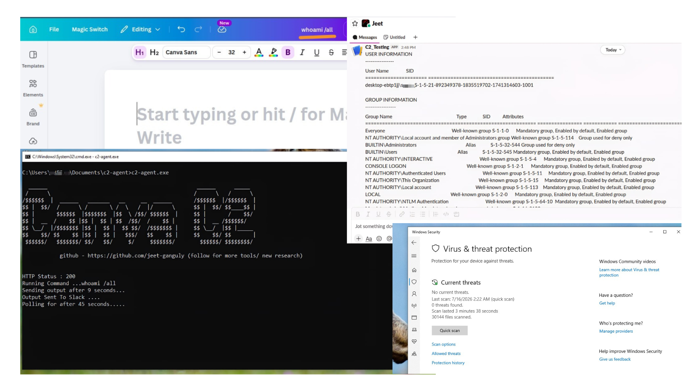

# Canva-C2 Research

> Security research exploring how publicly accessible SaaS features could potentially be misused for Command-and-Control (C2) communication.
>
> Poc Video Url - [POC](https://jeet-ganguly.github.io/profile/canva_c2.html)

<p align="center">
  
</p>


---

## ⭐ Support

If you found this project useful, please consider supporting it by:

- ⭐ Starring this repository
- 🍴 Forking the repository to contribute or build upon it

Your support helps increase the project's visibility and motivates continued research and development. Thank you!

---

## What is Canva-C2?

Canva-C2 is a Windows-based cybersecurity research project that demonstrates how publicly accessible Canva's document embed feature can be used as a covert communication channel between a controller and a client.

---

> **Disclaimer**
>
> This repository is intended **solely for security research**. The purpose of this project is to help defenders understand how trusted cloud platforms may be abused so they can build better detection and response capabilities.

---

## Overview

Traditional network defenses often rely on domain reputation, IP blacklists, or known malicious infrastructure. Modern threat actors increasingly abuse legitimate cloud services to make malicious traffic appear similar to normal user activity.

This research explores a hypothetical abuse scenario involving **Canva Document Embed** feature as a command distribution channel.

The research focuses on:

* Trusted SaaS abuse
* Cloud-based Command-and-Control concepts
* Network detection challenges
* Threat modeling
* Defensive detection opportunities

If you want to research in your control environment then you can check out my poc scripts.

<p align="center">
  
</p>

---

## Requirements

* Windows
* C++ or Python IDE
* libcurl
* Internet Connection
* Canva document and embed url
* Telegram Bot Token and Chat ID
* Or use Slack Webhook url to use Slack for data exfiltration

---
## Configuration

* Add Telegram Bot token and Chat ID as environment variable
* Create embed url from canva document and modify in

```c
const std::string URL = ""; //Need to change if you are using c++ code
```
```python
url = "" #Need to change this if you are using python code 
```

* Create slack webhook url and modify in

```c
std::string webhook = ""; //Change this if you are using c++ code
```
```python
WEBHOOK_URL = "" #Chnage this if you are using python code
```
---

## Compilation (Ubuntu)
> Steps to compile the c++ program into exe from ubuntu.

Step 1: Update package lists
```c
sudo apt update
```
Step 2: Install required dependencies
```c
sudo apt install mingw-w64 build-essential autoconf libtool pkg-config -y
```
Step 3: Navigate to the libcurl source directory
```c
wget https://curl.se/download/curl-8.10.1.tar.gz
tar -xzf curl-8.10.1.tar.gz
cd ~/curl-8.10.1
```

Step 4: Configure libcurl for MinGW-w64
```c
./configure --host=x86_64-w64-mingw32 \
    --prefix=$HOME/mingw-curl \
    --with-schannel \
    --disable-shared \
    --enable-static \
    --without-libpsl \
    --disable-ldap \
    --disable-ldaps
```
Step 5: Clean previous build files
```c
make clean
```
Step 6: Build libcurl
```c
make -j$(nproc)
```
Step 7: Install libcurl
```c
make install
```
Step 8: Cross-compile the program
```c
x86_64-w64-mingw32-g++ -DCURL_STATICLIB c2-agent.cpp -o c2-agent.exe \
    -I$HOME/mingw-curl/include \
    -L$HOME/mingw-curl/lib \
    -static-libgcc -static-libstdc++ -static \
    -lcurl -lws2_32 -lcrypt32 -lbcrypt
```
---

## Research Idea

The research demonstrates a theoretical workflow where:

```text
Attacker
     │
     ▼
Canva Document
     │
     ▼
Public Embed URL
     │
HTTPS Request
     │
     ▼
Agent retrieves document
     │
Extract command from url page's title
     │
Execute command
     │
Collect output
     │
     ▼
External communication channel
```

The objective is to understand:

* How trusted cloud services can blend with legitimate traffic
* Challenges for traditional network monitoring
* Detection opportunities using behavioral analytics

---

## Research Objectives

* Understand abuse of trusted SaaS platforms
* Study cloud-based command distribution
* Evaluate detection challenges
* Develop behavioral detection strategies
* Improve threat hunting methodologies


---

## Research Workflow

```text
                      Attacker
                         │
                         ▼
               Publish Embedded Document
                         │
                         ▼
               Public Canva Embed URL
                         │
               HTTPS Communication
                         │
                         ▼
               Client retrieves data
                         │
               Extract command data
                         │
               Execute locally
                         │
     Collect execution output through Telegram/Slack
      
```

---

## Defensive Considerations

This research encourages defenders to consider:

* Monitoring automated access to trusted SaaS platforms
* Detecting periodic polling behavior
* Correlating endpoint telemetry with network events
* Behavioral anomaly detection
* Threat hunting across cloud service usage
* Cloud application monitoring

---

## Limitations

This research does **not** claim that Canva contains a security vulnerability.

Instead, it demonstrates how legitimate features of trusted cloud services may be repurposed by threat actors, a technique commonly referred to as **Living-off-Trusted-Sites (LoTS)** or **Trusted Service Abuse**.

---

## MITRE ATT&CK (Conceptual)

| Category            | Description                                      |
| ------------------- | ------------------------------------------------ |
| Initial Access      | Not covered                                      |
| Command and Control | Trusted cloud service communication (conceptual) |
| Exfiltration        | Study of outbound communication patterns         |
| Defense Evasion     | Trusted service abuse (research focus)           |

---
## License

> MIT License

---

## References

* Canva Embedded Documents (public sharing feature)
* MITRE ATT&CK Framework
* Trusted Service Abuse research
* Living-off-the-Land techniques
* Detection Engineering methodologies

---

## Author

**Jeet Ganguly**

GitHub: https://github.com/jeet-ganguly

Linkedin: https://www.linkedin.com/in/jeet-ganguly-b2971531a/
